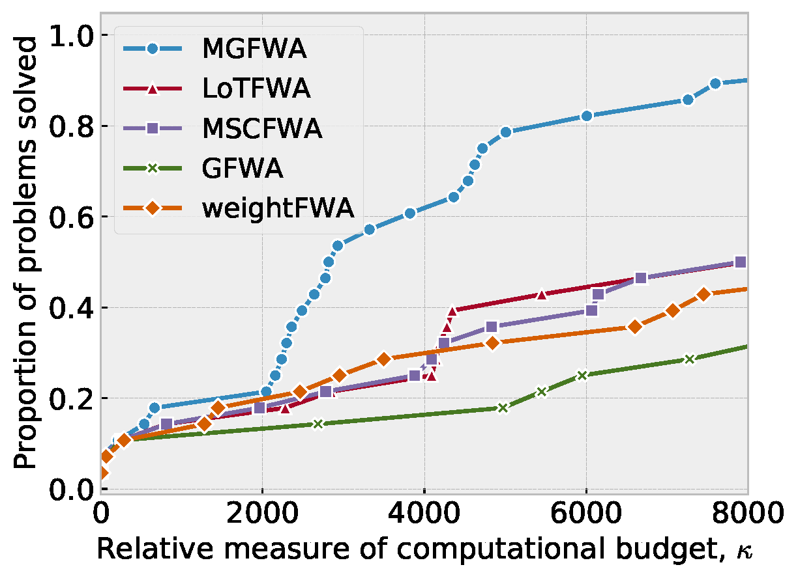
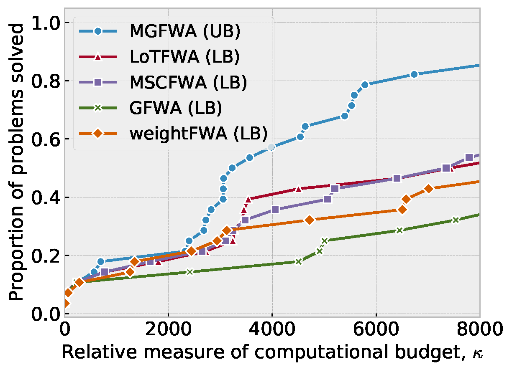
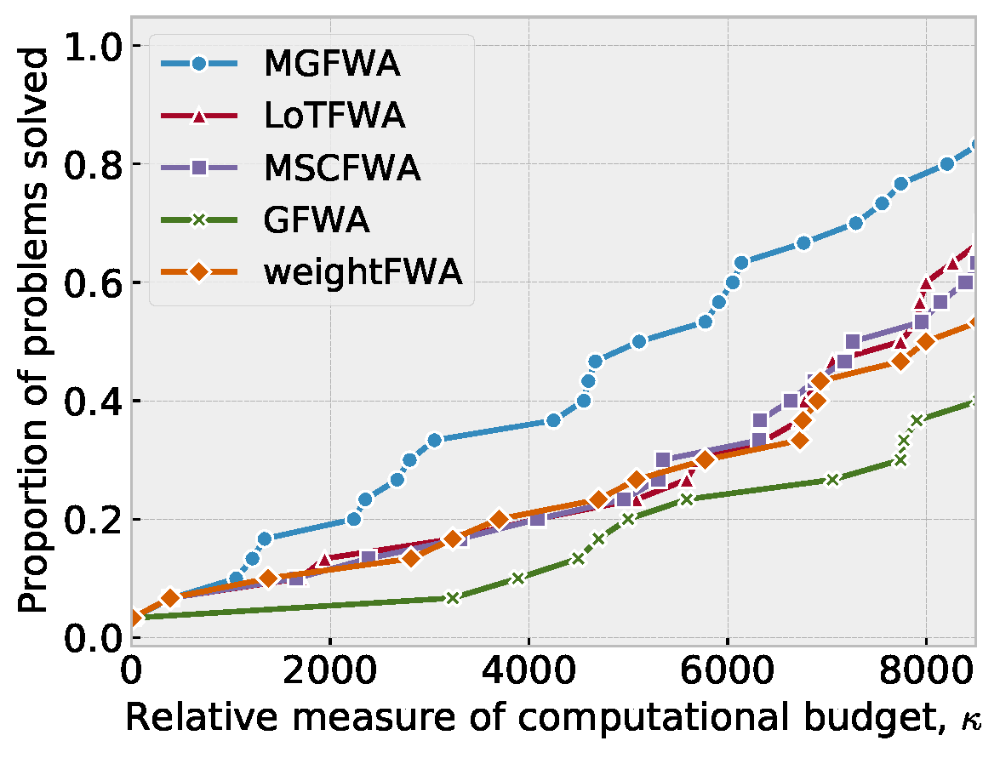
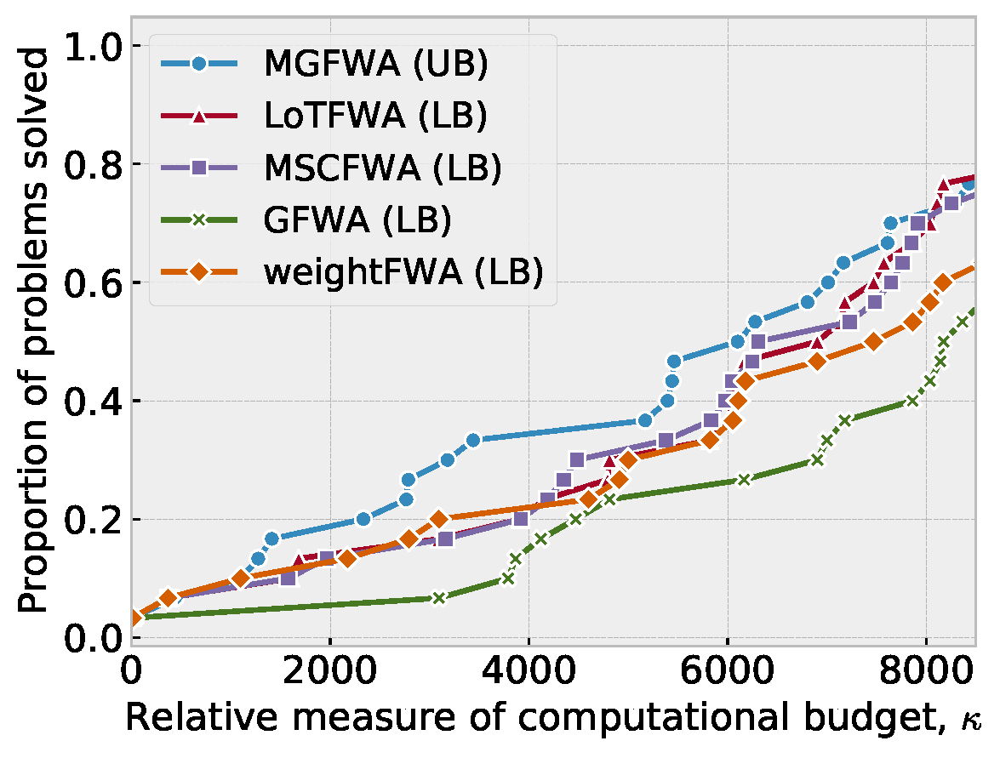
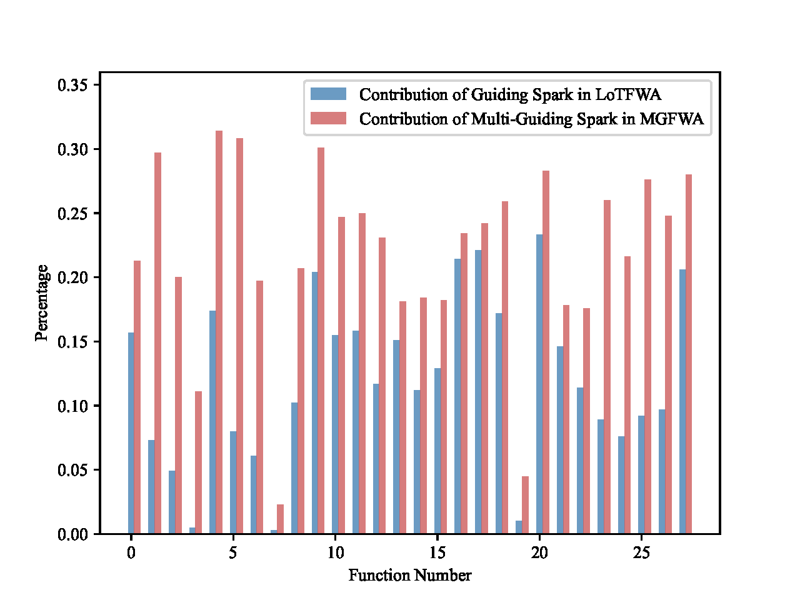

# Multi-Guiding Spark Fireworks Algorithm

### NEWS
✨ We have released a GPU-accelerated version of MGFWA (https://arxiv.org/abs/2501.03944), available in ```alg/GPU-MGFWA.py```. Please note that a custom neural network is required to fully utilize this optimization. 
***
This repository is the official implementation of the paper [Multi-Guiding Spark Fireworks Algorithm: Solving Multimodal Functions by Multiple Guiding Sparks in Fireworks Algorithm](https://www.sciencedirect.com/science/article/pii/S2210650223002304). The proposed method is powerful on multimodal global optimization, which is an efficient, performant, and state-of-the-art Fireworks Algorithm (FWA🎇) variant and easy to follow. Have fun enjoying it!

## Installation 💡
**Step1**: clone this repository

```shell
git clone https://github.com/mxxxr/MGFWA.git
```

**Step2**: create a conda environment

```shell
conda create -n fwa python=3.8
conda activate fwa
```

**Step3**: install the dependencies

```shell
cd MGFWA
pip install numpy tqdm .
```

## Run 🚀

Perform a stantard optimization process on the given benchmark (chosen from `cec2013` and `cec2017`) by the given algorithm (chosen from `MGFWA` and `LoTFWA`):

```
python optimize.py --alg MGFWA --benchmark cec2013
```

The whole process will optimize each Function 51 times. After finishing the optimization of a single Funciton, the results will be output in the terminal:

```python
Function #1, Optimizing...
MAX: 0.0
MIN: 0.0
MEAN: 0.0
MEDIAN: 0.0
STD: 0.0
Average runtime of a run: 17.03
```

## Results 📈

> Please refer to the paper for more quantitative results.

### Data Profiles Method Analyzing 

 

 

### Contribution of the Multi-Guiding Spark


## Citation

If you found this repository useful, please consider citing our work:

```
@article{MENG2023101458,
  title = {Multi-guiding spark fireworks algorithm: Solving multimodal functions by multiple guiding sparks in fireworks algorithm},
  author = {Xiangrui Meng and Ying Tan},
  journal = {Swarm and Evolutionary Computation},
  pages = {101458},
  year = {2023},
  issn = {2210-6502},
  doi = {https://doi.org/10.1016/j.swevo.2023.101458},
  url = {https://www.sciencedirect.com/science/article/pii/S2210650223002304}
}
```
```
@misc{meng2025gpuimplementationmultiguidingspark,
      title={A GPU Implementation of Multi-Guiding Spark Fireworks Algorithm for Efficient Black-Box Neural Network Optimization}, 
      author={Xiangrui Meng and Ying Tan},
      year={2025},
      eprint={2501.03944},
      archivePrefix={arXiv},
      primaryClass={cs.NE},
      url={https://arxiv.org/abs/2501.03944}, 
}
```
## License

This repository is licensed under [Apache 2.0](LICENSE)

